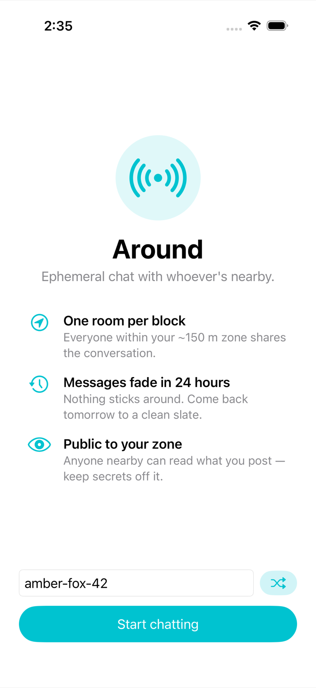
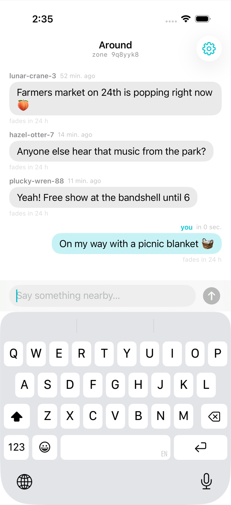
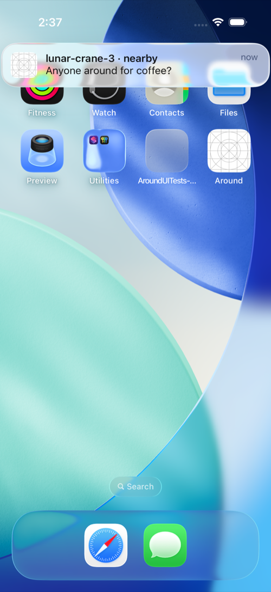

# Around

Ephemeral chat with whoever's nearby. Inspired by [BitChat](https://github.com/permissionlesstech/bitchat),
but built for **reliable delivery and real push notifications**, which iOS's
background Bluetooth restrictions make impossible for a pure mesh app.
The trade-off is a server in the middle — Apple's, not ours.

- **Zones, not friends.** Your location maps to a precision-7 geohash cell
  (~150 m). Everyone in your cell — plus the 8 cells touching it, so
  conversations don't cut off at a border — shares one room.
- **Ephemeral.** Messages fade 24 hours after they're sent. Clients filter
  by timestamp and each device deletes its own expired messages on launch.
- **No accounts.** Identity is a random per-device ID plus a handle like
  `amber-fox-42`. Writes ride the user's iCloud account behind the scenes.
- **Honest privacy story.** Messages are public to the zone and transit
  Apple's servers. Only the zone code is attached — never raw coordinates.
  This is *not* anonymous like BitChat; that's the price of notifications.

## Architecture

```
SwiftUI (ChatView, Onboarding, Settings)
        │
   ChatViewModel ── LocationService (CoreLocation → geohash cell)
        │
   MessageTransport (protocol)
        ├── CloudKitTransport   production: CloudKit public DB
        └── FileTransport       DEBUG/tests: shared directory on disk
        │
   AroundCore (SPM, pure Swift): Geohash, Message, MessageRules, HandleGenerator
```

**Why CloudKit?** The public database is free (quota scales with users),
needs no server, and `CKQuerySubscription` makes Apple send a real APNs
push when a record lands in a zone you're subscribed to. When we outgrow
it (server-side TTL, rate limiting, non-Apple clients), the plan is a small
Vapor/Node service on the Raspberry Pi — it slots in as a third
`MessageTransport` without touching the UI.

Each device keeps CKQuerySubscriptions for its 9 zones (reconciled whenever
you move to a new cell). CloudKit predicates can't express `senderID != me`,
so pushes for your own messages are suppressed client-side in
`AppDelegate.userNotificationCenter(_:willPresent:)`.

## Building

```bash
brew install xcodegen   # once
xcodegen generate
xcodebuild -project Around.xcodeproj -scheme Around \
  -destination 'platform=iOS Simulator,name=iPhone 17 Pro' build
```

## Testing

```bash
# Unit tests (geohash vectors, TTL/dedupe rules, handles)
cd AroundCore && swift test

# Single-simulator E2E (onboarding, send/receive, TTL, notification banner)
xcodebuild test -project Around.xcodeproj -scheme Around \
  -destination 'platform=iOS Simulator,name=iPhone 17 Pro' \
  -only-testing:AroundUITests/AroundFlowTests

# Two simulators holding a live conversation with each other
scripts/two_sim_e2e.sh

# Regenerate screenshots/
xcodebuild test -project Around.xcodeproj -scheme Around \
  -destination 'platform=iOS Simulator,name=iPhone 17 Pro' \
  -only-testing:AroundUITests/ScreenshotTourTests
```

Tests use `FileTransport` (env `AROUND_TRANSPORT_DIR`): each message is a
JSON file in a shared host directory, which simulators poll. This exercises
the full UI, zone logic, and notification UX without an iCloud login.
Test conveniences: `--reset-data`, `--auto-onboard`, `AROUND_HANDLE`,
`AROUND_FAKE_LOCATION="lat,lon"`.

## Screenshots

| Onboarding | Chat | Notification |
|---|---|---|
|  |  |  |

## CloudKit setup (done for Development — July 2026)

Already provisioned: the `iCloud.com.sank.around` container is registered,
the `Message` record type exists (text, senderID, senderName, geohash:
String; sentAt: Date/Time), and Development indexes are in place —
`geohash` + `senderID` queryable, `sentAt` queryable + sortable. The real
fetch path is verified: a record created in CloudKit Console appears in
the app on a simulator (see `screenshots/e2e-cloudkit-fetch.png`; run it
yourself with `CloudKitSmokeTests`).

Still pending:

1. **Send path on a real account** — writing (and saving zone push
   subscriptions) requires a device/simulator signed into iCloud; public-DB
   reads don't. Send a message from a signed-in device to verify.
2. **Deploy the schema to Production** (CloudKit Console → Deploy Schema
   Changes) before TestFlight.

Known follow-ups: server-side cleanup of expired records (a tiny cron on the
Pi hitting CloudKit Web Services), report/block for App Store guideline 1.2,
and an app icon.
